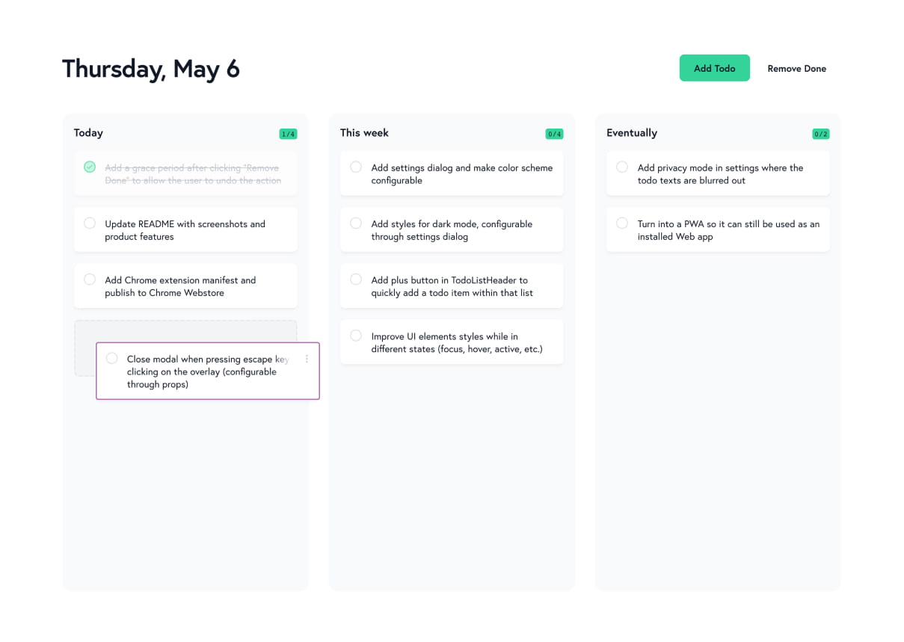

# Simple Todo

A Chrome extension that replaces the new tab page with a simple todo list.



## Features

- Manage todo items across three predefined lists
- All data are stored locally and not sent to any server
- More features coming soon! ✨

## Contributing

Thanks for your interest to contribute to this project! To get started, setup and run this repository on your machine.

```bash
git clone https://github.com/arnellebalane/simple-todo.git
cd simple-todo

# Install dependencies
npm ci

# Run local server
npm run dev

# Build for production
npm run build
```

## License

[MIT License](license)
